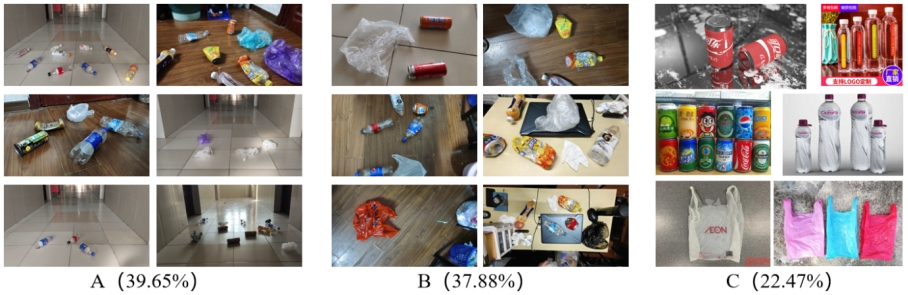
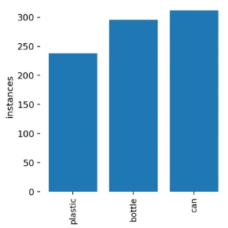
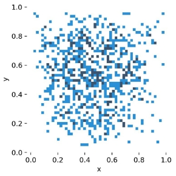
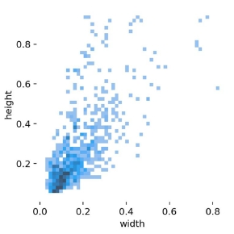
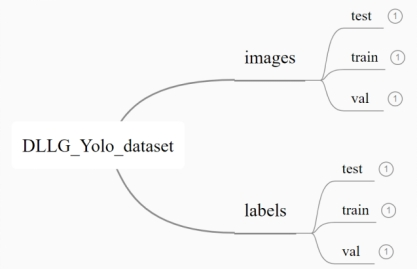
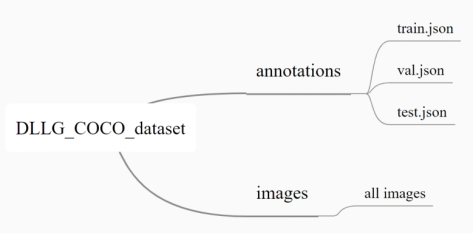

# 道路垃圾数据集（DLLG数据集）

## 0 简介

本人本科毕业时候做了个《基于深度学习的道路垃圾清理机器人》，后发到b站发现问我要数据集的人还挺多的。[基于YOLOv5的道路垃圾识别（塑料袋、饮料瓶、易拉罐三类）_哔哩哔哩_bilibili](https://www.bilibili.com/video/BV1uB4y1X7z9/?spm_id_from=333.999.0.0&vd_source=f28939dc0e342331c3f0f0bd48dd9378)

最近在旧的固态里找到了当时的数据集，在这里分享给有需求的朋友。

## 1 数据集来源与内容

**道路垃圾数据集**（后简称 **DLLG 数据集**）。图片来源：A以道路垃圾拾取机器人视角拍摄（39.65%），B手机相机随机拍摄道路垃圾图片（37.88%），C可以参考的网络图片（22.47%）。

为增强该数据集训练的网络的鲁棒性，收集过程的更多细节如下：①随机分时段、分天气拍摄照片，增加图片背景类别；②光照随机，获得不同光照、不同角度下道路垃圾表层特征；③增加踩扁易拉罐、踩扁饮料瓶瓶身案例。

DLLG数据集中的类别数量如下，包含241个塑料袋类标签、294个饮料瓶瓶类标签，312个易拉罐标签；目标框中心位置分布如图3-2（b），无明显集中；目标框长宽情况如图3-2（c），以小目标为主，含各分散段尺寸的目标。

| 类别     | 塑料袋 | 饮料瓶 | 易拉罐 |
| -------- | ------ | ------ | ------ |
| 类别占比 | 28.45% | 34.71% | 36.84% |

## 2 道路垃圾数据集格式

这里提供为COCO和Yolo格式。不同DLLG数据集文件目录如图。（好吧COCO格式的还在整理，后续整理好了再上传）

